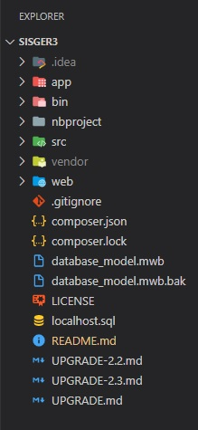
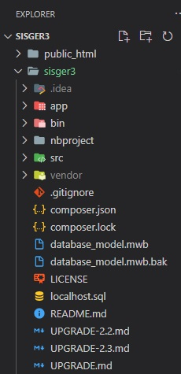

SISGER3
========================

## 1) Deploy and environment configuration
----------------------------------

When you will deploy SISGER3 project, you will need to configure the environment to production: 


### 1) Change Proyect Structure in development to Production environment:

 

The first thing is to extract all the elements in the `web` folder and copy them to the `public_html` folder in the hosting.

### 2) Enable HTTP to HTTPS switching in (web/.htaccess or public_html/.htaccess) (development->disabled / production->enabled)
```
<IfModule mod_rewrite.c>
    RewriteEngine On
    
    # CAMBIAR DE HTTP A HTTPS
    # RewriteCond %{HTTPS} !=on
    # RewriteCond %{REQUEST_URI} !^/\.well-known/acme-challenge/[0-9a-zA-Z_-]+$
    # RewriteCond %{REQUEST_URI} !^/\.well-known/cpanel-dcv/[0-9a-zA-Z_-]+$
    # RewriteCond %{REQUEST_URI} !^/\.well-known/pki-validation/[A-F0-9]{32}\.txt(?:\ Comodo\ DCV)?$
    #  RewriteRule ^/?(.*) https://%{SERVER_NAME}/$1 [R=301,L]
</IfModule>

```


### 2) Load AppKernel location and bootstrap.php.cache in app.php and app_dev.php
```
$loader = require_once __DIR__.'/../app/bootstrap.php.cache';  //(development)
// $loader = require_once __DIR__.'/../sisger3/app/bootstrap.php.cache';  //(production)
Debug::enable();

require_once __DIR__.'/../app/AppKernel.php';  //(development)
// require_once __DIR__.'/../sisger3/app/AppKernel.php';  //(production)

```

### 3) Enable production or development environment in app.php and app_dev.php
```
$kernel = new AppKernel('prod', true);

```
```
$kernel = new AppKernel('dev', true);

```

### 4) Configure database parameters in app.php and app_dev.php
```
database_host: 127.0.0.1
database_port: null
database_name: sisger_3
database_user: root
database_password: null
```


## 2) Routes and Controllers
-------------------------------------
`For routes run-->php app/console router:debug`

```
Name                                       Method      Scheme Host Path
_wdt                                       ANY         ANY    ANY  /_wdt/{token}
_profiler_home                             ANY         ANY    ANY  /_profiler/
_profiler_search                           ANY         ANY    ANY  /_profiler/search
_profiler_search_bar                       ANY         ANY    ANY  /_profiler/search_bar
_profiler_purge                            ANY         ANY    ANY  /_profiler/purge
_profiler_info                             ANY         ANY    ANY  /_profiler/info/{about}
_profiler_phpinfo                          ANY         ANY    ANY  /_profiler/phpinfo
_profiler_search_results                   ANY         ANY    ANY  /_profiler/{token}/search/results
_profiler                                  ANY         ANY    ANY  /_profiler/{token}
_profiler_router                           ANY         ANY    ANY  /_profiler/{token}/router
_profiler_exception                        ANY         ANY    ANY  /_profiler/{token}/exception
_profiler_exception_css                    ANY         ANY    ANY  /_profiler/{token}/exception.css
_configurator_home                         ANY         ANY    ANY  /_configurator/
_configurator_step                         ANY         ANY    ANY  /_configurator/step/{index}
_configurator_final                        ANY         ANY    ANY  /_configurator/final
index                                      ANY         ANY    ANY  /
login                                      ANY         ANY    ANY  /login
login_check                                ANY         ANY    ANY  /login_check
logout                                     ANY         ANY    ANY  /logout
contact                                    ANY         ANY    ANY  /contact
change_skin                                ANY         ANY    ANY  /{skin}/change_skin
phone                                      ANY         ANY    ANY  /phone/
phone_show                                 ANY         ANY    ANY  /phone/{id}/show
phone_new                                  ANY         ANY    ANY  /phone/new
phone_create                               POST        ANY    ANY  /phone/create
phone_edit                                 ANY         ANY    ANY  /phone/{id}/edit
phone_update                               POST|PUT    ANY    ANY  /phone/{id}/update
phone_delete                               POST|DELETE ANY    ANY  /phone/{id}/delete
client                                     ANY         ANY    ANY  /client/
client_pdf                                 ANY         ANY    ANY  /client/pdf
client_xls                                 ANY         ANY    ANY  /client/xls
client_filter                              ANY         ANY    ANY  /client/filter
client_show                                ANY         ANY    ANY  /client/{id}/show
client_new                                 ANY         ANY    ANY  /client/new
client_create                              POST        ANY    ANY  /client/create
client_create1                             POST        ANY    ANY  /client/create_full
client_edit                                ANY         ANY    ANY  /client/{id}/edit
client_edit1                               ANY         ANY    ANY  /client/{id}/edit1
client_edit2                               ANY         ANY    ANY  /client/{id}/edit2
client_edit3                               ANY         ANY    ANY  /client/{id}/edit3
client_update                              POST|PUT    ANY    ANY  /client/{id}/update
client_update_1                            POST|PUT    ANY    ANY  /client/{id}/update_lbrs
client_delete                              ANY         ANY    ANY  /client/{id}/delete
client_batch_delete                        POST        ANY    ANY  /client/client_batch_delete
client_data                                ANY         ANY    ANY  /client/client_data
getClients                                 ANY         ANY    ANY  /client/getClients
get_clients_by_operators_month             ANY         ANY    ANY  /client/get_clients_by_operators_month
get_clients_by_operators                   ANY         ANY    ANY  /client/get_clients_by_operators
get_clients_by_operators_ws                ANY         ANY    ANY  /client/get_clients_by_operators_ws
client_verificar_dni                       ANY         ANY    ANY  /client/verificar_dni
client_verificar_passport                  ANY         ANY    ANY  /client/verificar_dni
reply                                      ANY         ANY    ANY  /reply/{ws}/index
reply_index_by_user                        ANY         ANY    ANY  /reply/user/{id}/ws/{ws}/index_by_user
reply_index_by_client                      ANY         ANY    ANY  /reply/cliente/{id}/ws/{ws}/index
reply_all                                  ANY         ANY    ANY  /reply/index_all
reply_show                                 ANY         ANY    ANY  /reply/{id}/show
reply_voucher                              ANY         ANY    ANY  /reply/{id}/voucher
reply_receipe                              ANY         ANY    ANY  /reply/{id}/receipe
reply_print                                ANY         ANY    ANY  /reply/{id}/print
reply_new                                  ANY         ANY    ANY  /reply/new
reply_create                               POST        ANY    ANY  /reply/create
reply_edit                                 ANY         ANY    ANY  /reply/{id}/edit
reply_update                               POST|PUT    ANY    ANY  /reply/{id}/update
reply_delete                               ANY         ANY    ANY  /reply/{id}/delete
reply_batch_delete                         POST        ANY    ANY  /reply/{ws}/reply_batch_delete
reply_batch_delete_all                     POST        ANY    ANY  /reply/reply_batch_delete_all
getReplies                                 ANY         ANY    ANY  /reply/getReplies
get_replies_by_operators                   ANY         ANY    ANY  /reply/get_replies_by_operators
get_replies_by_operators_ws                ANY         ANY    ANY  /reply/get_replies_by_operators_ws
reply_by_month_year                        ANY         ANY    ANY  /reply/{month}/{year}/get_replies_by_month_year
reply_by_month_year_and_ws                 ANY         ANY    ANY  /reply/{month}/{year}/{ws}/get_replies_by_month_year_and_ws
reply_by_year                              ANY         ANY    ANY  /reply/{year}/get_replies_by_year
reply_by_year_and_ws                       ANY         ANY    ANY  /reply/{year}/{ws}/get_replies_by_year_and_ws
reply_report                               ANY         ANY    ANY  /reply/generate_reply_report
reply_xls                                  ANY         ANY    ANY  /reply/xls
reply_report_by_ws                         ANY         ANY    ANY  /reply/{ws}/generate_reply_report_by_ws
reply_filter_by_ws                         ANY         ANY    ANY  /reply/{ws}/filtrar
reply_filter_tree_by_ws                    ANY         ANY    ANY  /reply/{month}/{year}/{usuario}/{ws}/filtrar_tree
reply_filter                               ANY         ANY    ANY  /reply/filtrar
service                                    ANY         ANY    ANY  /service/{ws}/index
service_show                               ANY         ANY    ANY  /service/{id}/show
service_new                                ANY         ANY    ANY  /service/new
service_create                             POST        ANY    ANY  /service/create
service_create1                            POST        ANY    ANY  /service/create_full
service_edit                               ANY         ANY    ANY  /service/{id}/edit
service_update                             POST|PUT    ANY    ANY  /service/update
service_delete                             ANY         ANY    ANY  /service/{id}/delete
service_batch_delete                       POST        ANY    ANY  /service/{ws}/service_batch_delete
service_filter                             ANY         ANY    ANY  /service/filter
user                                       ANY         ANY    ANY  /user/
user_show                                  ANY         ANY    ANY  /user/{id}/show
user_new                                   ANY         ANY    ANY  /user/new
user_create                                POST        ANY    ANY  /user/create
user_load_workspace_nomencladores          ANY         ANY    ANY  /user/workspace_nomencladores
user_load_workspace_nomencladores_new_user ANY         ANY    ANY  /user/workspace_nomencladores_new_user
user_edit                                  ANY         ANY    ANY  /user/{id}/edit
user_update                                POST|PUT    ANY    ANY  /user/{id}/update
user_update_password                       POST|PUT    ANY    ANY  /user/{id}/update_password
user_update_avatar                         POST|PUT    ANY    ANY  /user/{id}/update_avatar
user_update_permisos                       POST|PUT    ANY    ANY  /user/{id}/update_permisos
user_delete                                ANY         ANY    ANY  /user/{id}/delete
user_batch_delete                          POST        ANY    ANY  /user/user_batch_delete
user_switch_workspace                      ANY         ANY    ANY  /user/{name}/switch
user_get_length                            ANY         ANY    ANY  /user/get_users_length
user_get_operators                         ANY         ANY    ANY  /user/get_operators
user_get_operators_by_ws                   ANY         ANY    ANY  /user/get_operators_by_ws
user_verificar_password                    ANY         ANY    ANY  /user/verificar_password
user_verificar_username                    ANY         ANY    ANY  /user/verificar_username
user_verificar_letra                       ANY         ANY    ANY  /user/verificar_letra
user_filter                                ANY         ANY    ANY  /user/filter
role                                       ANY         ANY    ANY  /role/
role_show                                  ANY         ANY    ANY  /role/{id}/show
role_new                                   ANY         ANY    ANY  /role/new
role_create                                POST        ANY    ANY  /role/create
role_edit                                  ANY         ANY    ANY  /role/{id}/edit
role_update                                POST|PUT    ANY    ANY  /role/update
role_delete                                ANY         ANY    ANY  /role/{id}/delete
role_batch_delete                          POST        ANY    ANY  /role/role_batch_delete
agency                                     ANY         ANY    ANY  /agency/
agency_show                                ANY         ANY    ANY  /agency/{id}/show
agency_new                                 ANY         ANY    ANY  /agency/new
agency_create                              POST        ANY    ANY  /agency/create
agency_edit                                ANY         ANY    ANY  /agency/{id}/edit
agency_update                              POST|PUT    ANY    ANY  /agency/update
agency_delete                              ANY         ANY    ANY  /agency/{id}/delete
agency_batch_delete                        POST        ANY    ANY  /agency/agency_batch_delete
voucher                                    ANY         ANY    ANY  /voucher/{ws}/index
voucher_show                               ANY         ANY    ANY  /voucher/{id}/show
voucher_new                                ANY         ANY    ANY  /voucher/{idReply}/new
voucher_reply                              ANY         ANY    ANY  /voucher/{idReply}/vouchers
voucher_export_reply                       ANY         ANY    ANY  /voucher/{idReply}/export_vouchers
getVouchers                                ANY         ANY    ANY  /voucher/getVouchers
voucher_create                             POST        ANY    ANY  /voucher/create
voucher_edit                               ANY         ANY    ANY  /voucher/{id}/edit
voucher_generate_pdf                       ANY         ANY    ANY  /voucher/voucher/{voucherId}/pdf
voucher_update                             POST|PUT    ANY    ANY  /voucher/{id}/update
voucher_cancel                             ANY         ANY    ANY  /voucher/{id}/cancel
voucher_activate                           ANY         ANY    ANY  /voucher/{id}/activate
generate_voucher_report                    ANY         ANY    ANY  /voucher/generate_voucher_report
generate_voucher_report_by_ws              ANY         ANY    ANY  /voucher/{ws}/generate_voucher_report_by_ws
voucher_filter_by_ws                       ANY         ANY    ANY  /voucher/{ws}/filtrar
voucher_filter_tree_by_ws                  ANY         ANY    ANY  /voucher/{month}/{year}/{usuario}/{ws}/filtrar_tree
receipe                                    ANY         ANY    ANY  /receipe/{ws}/index
receipe_all                                ANY         ANY    ANY  /receipe/all
receipe_show                               ANY         ANY    ANY  /receipe/{id}/show
receipe_new_income                         ANY         ANY    ANY  /receipe/{idReply}/new_income
receipe_new_expendation                    ANY         ANY    ANY  /receipe/new_expendation
receipe_new_cost                           ANY         ANY    ANY  /receipe/{idReply}/new_cost
receipe_reply                              ANY         ANY    ANY  /receipe/{idReply}/receipes
receipe_export_reply                       ANY         ANY    ANY  /receipe/{idReply}/export_receipes
receipe_create_income                      POST        ANY    ANY  /receipe/create_income
receipe_create_expendation                 POST        ANY    ANY  /receipe/create_expendation
receipe_create_cost                        POST        ANY    ANY  /receipe/create_cost
receipe_edit                               ANY         ANY    ANY  /receipe/{id}/edit
receipe_update                             POST|PUT    ANY    ANY  /receipe/{id}/update
receipe_cancel                             ANY         ANY    ANY  /receipe/{id}/cancel
receipe_activate                           ANY         ANY    ANY  /receipe/{id}/activate
getReceipes                                ANY         ANY    ANY  /receipe/getReceipes
receipe_generate_pdf                       ANY         ANY    ANY  /receipe/invoice/{receipeId}/pdf
generate_receipe_report                    ANY         ANY    ANY  /receipe/generate_receipe_report
generate_receipe_report_by_ws              ANY         ANY    ANY  /receipe/{ws}/generate_receipe_report_by_ws
recibo                                     ANY         ANY    ANY  /recibo/{ws}/index
recibo_all                                 ANY         ANY    ANY  /recibo/all
recibo_show                                ANY         ANY    ANY  /recibo/{id}/show
recibo_new_income                          ANY         ANY    ANY  /recibo/{idReply}/new_income
recibo_new_expendation                     ANY         ANY    ANY  /recibo/new_expendation
recibo_new_cost                            ANY         ANY    ANY  /recibo/{idReply}/new_cost
recibo_reply                               ANY         ANY    ANY  /recibo/expediente/{idReply}/recibos
recibo_export_reply                        ANY         ANY    ANY  /recibo/{idReply}/export_recibos
recibo_create_income                       POST        ANY    ANY  /recibo/create_income
recibo_create_expendation                  POST        ANY    ANY  /recibo/create_expendation
recibo_create_cost                         POST        ANY    ANY  /recibo/create_cost
recibo_edit                                ANY         ANY    ANY  /recibo/{id}/edit
recibo_update                              POST|PUT    ANY    ANY  /recibo/{id}/update
recibo_cancel                              ANY         ANY    ANY  /recibo/cancel
recibo_activate                            ANY         ANY    ANY  /recibo/{id}/activate
getRecibos                                 ANY         ANY    ANY  /recibo/getRecibos
recibo_generate_pdf                        ANY         ANY    ANY  /recibo/invoice/{reciboId}/pdf
generate_recibo_report                     ANY         ANY    ANY  /recibo/generate_recibo_report
generate_expendations_report               ANY         ANY    ANY  /recibo/generate_expenditures_report
generate_recibo_report_by_ws               ANY         ANY    ANY  /recibo/{ws}/generate_recibo_report_by_ws
recibo_filter_by_ws                        ANY         ANY    ANY  /recibo/{ws}/filtrar
recibo_filter                              ANY         ANY    ANY  /recibo/filtrar
recibo_filter_tree_by_ws                   ANY         ANY    ANY  /recibo/{month}/{year}/{usuario}/{ws}/filtrar_tree
recibo_egresos                             ANY         ANY    ANY  /recibo/{ws}/egresos
recibo_salvar_egresos                      ANY         ANY    ANY  /recibo/egresos/save
recibo_salvar                              ANY         ANY    ANY  /recibo/save
ingreso                                    ANY         ANY    ANY  /ingreso/{workspace}/index
ingreso_all                                ANY         ANY    ANY  /ingreso/all
ingreso_show                               ANY         ANY    ANY  /ingreso/{id}/show
ingreso_new                                ANY         ANY    ANY  /ingreso/{idReply}/new
ingreso_reply                              ANY         ANY    ANY  /ingreso/{idReply}/ingresos
ingreso_export_reply                       ANY         ANY    ANY  /ingreso/{idReply}/exportar_ingresos
ingreso_create                             POST        ANY    ANY  /ingreso/create
ingreso_edit                               ANY         ANY    ANY  /ingreso/{id}/edit
ingreso_update                             POST|PUT    ANY    ANY  /ingreso/{id}/update
ingreso_cancel                             ANY         ANY    ANY  /ingreso/{id}/cancel
ingreso_activate                           ANY         ANY    ANY  /ingreso/{id}/activate
getIngresos                                ANY         ANY    ANY  /ingreso/getIngresos
ingreso_generate_pdf                       ANY         ANY    ANY  /ingreso/invoice/{reciboId}/pdf
generate_ingreso_report                    ANY         ANY    ANY  /ingreso/generar_reporte_ingresos
generate_ingreso_report_by_ws              ANY         ANY    ANY  /ingreso/{ws}/generar_reporte_ingresos_por_ws
gasto                                      ANY         ANY    ANY  /gasto/
gasto_show                                 ANY         ANY    ANY  /gasto/{id}/show
gasto_new                                  ANY         ANY    ANY  /gasto/{idReply}/new
gasto_create                               POST        ANY    ANY  /gasto/create
gasto_edit                                 ANY         ANY    ANY  /gasto/{id}/edit
gasto_update                               POST|PUT    ANY    ANY  /gasto/{id}/update
gasto_delete                               POST|DELETE ANY    ANY  /gasto/{id}/delete
costo                                      ANY         ANY    ANY  /costo/
costo_show                                 ANY         ANY    ANY  /costo/{id}/show
costo_new                                  ANY         ANY    ANY  /costo/{idReply}/new
costo_create                               POST        ANY    ANY  /costo/create
costo_edit                                 ANY         ANY    ANY  /costo/{id}/edit
costo_update                               POST|PUT    ANY    ANY  /costo/{id}/update
costo_delete                               POST|DELETE ANY    ANY  /costo/{id}/delete
costorecurrente                            ANY         ANY    ANY  /costorecurrente/
costorecurrente_show                       ANY         ANY    ANY  /costorecurrente/{id}/show
costorecurrente_new                        ANY         ANY    ANY  /costorecurrente/{idReply}/new
costorecurrente_create                     POST        ANY    ANY  /costorecurrente/create
costorecurrente_edit                       ANY         ANY    ANY  /costorecurrente/{id}/edit
costorecurrente_update                     POST|PUT    ANY    ANY  /costorecurrente/{id}/update
costorecurrente_delete                     POST|DELETE ANY    ANY  /costorecurrente/{id}/delete
get_replies_length                         ANY         ANY    ANY  /get_replies_length
get_clients_length                         ANY         ANY    ANY  /get_clients_length
get_services_length                        ANY         ANY    ANY  /get_services_length
get_agencies_length                        ANY         ANY    ANY  /get_agencies_length
searcher                                   ANY         ANY    ANY  /searcher
executeSearch                              ANY         ANY    ANY  /executeSearch
get_document_types                         ANY         ANY    ANY  /get_document_types
document                                   ANY         ANY    ANY  /document/
document_show                              ANY         ANY    ANY  /document/{id}/show
document_new                               ANY         ANY    ANY  /document/new
document_create                            POST        ANY    ANY  /document/create
document_edit                              ANY         ANY    ANY  /document/{id}/edit
document_update                            POST|PUT    ANY    ANY  /document/{id}/update
document_delete                            ANY         ANY    ANY  /document/{id}/delete
document_batch_delete                      POST        ANY    ANY  /document/document_batch_delete
document_client                            ANY         ANY    ANY  /document/{idClient}/documents
workspace_get_nomencladores                ANY         ANY    ANY  /workspace/permisos
banking                                    ANY         ANY    ANY  /banking/{ws}/index
banking_all                                ANY         ANY    ANY  /banking/indexAll
banking_show                               ANY         ANY    ANY  /banking/{id}/show
banking_new                                ANY         ANY    ANY  /banking/new
banking_create                             POST        ANY    ANY  /banking/create
banking_edit                               ANY         ANY    ANY  /banking/{id}/edit
banking_update                             POST|PUT    ANY    ANY  /banking/{id}/update
banking_delete                             ANY         ANY    ANY  /banking/{id}/delete
banking_batch_delete                       POST        ANY    ANY  /banking/{workspace}/banking_batch_delete
banking_batch_delete_all                   POST        ANY    ANY  /banking/banking_batch_delete_all
banking_payment                            ANY         ANY    ANY  /banking/getBankingsByPaymentMethod
bank                                       ANY         ANY    ANY  /bank/
bank_show                                  ANY         ANY    ANY  /bank/{id}/show
bank_timeline                              ANY         ANY    ANY  /bank/{id}/timeline
bank_new                                   ANY         ANY    ANY  /bank/new
bank_create                                POST        ANY    ANY  /bank/create
bank_edit                                  ANY         ANY    ANY  /bank/{id}/edit
bank_update                                POST|PUT    ANY    ANY  /bank/{id}/update
bank_delete                                ANY         ANY    ANY  /bank/{id}/delete
bank_reporte_por_rango_de_fechas           ANY         ANY    ANY  /bank/{banking}/pdf
card                                       ANY         ANY    ANY  /card/
card_show                                  ANY         ANY    ANY  /card/{id}/show
card_timeline                              ANY         ANY    ANY  /card/{id}/timeline
card_new                                   ANY         ANY    ANY  /card/new
card_create                                POST        ANY    ANY  /card/create
card_edit                                  ANY         ANY    ANY  /card/{id}/edit
card_update                                POST|PUT    ANY    ANY  /card/{id}/update
card_delete                                ANY         ANY    ANY  /card/{id}/delete
card_reporte_por_rango_de_fechas           ANY         ANY    ANY  /card/{banking}/pdf
cash                                       ANY         ANY    ANY  /cash/
cash_show                                  ANY         ANY    ANY  /cash/{id}/show
cash_timeline                              ANY         ANY    ANY  /cash/{id}/timeline
cash_new                                   ANY         ANY    ANY  /cash/new
cash_create                                POST        ANY    ANY  /cash/create
cash_edit                                  ANY         ANY    ANY  /cash/{id}/edit
cash_update                                POST|PUT    ANY    ANY  /cash/{id}/update
cash_delete                                ANY         ANY    ANY  /cash/{id}/delete
cash_reporte_por_rango_de_fechas           ANY         ANY    ANY  /cash/{banking}/pdf
traspaso                                   ANY         ANY    ANY  /traspaso/
traspaso_show                              ANY         ANY    ANY  /traspaso/{id}/show
traspaso_new                               ANY         ANY    ANY  /traspaso/new
traspaso_create                            POST        ANY    ANY  /traspaso/create
traspaso_edit                              ANY         ANY    ANY  /traspaso/{id}/edit
traspaso_update                            POST|PUT    ANY    ANY  /traspaso/{id}/update
traspaso_delete                            ANY         ANY    ANY  /traspaso/{id}/delete
extra                                      ANY         ANY    ANY  /extra/
extra_show                                 ANY         ANY    ANY  /extra/{id}/show
extra_new                                  ANY         ANY    ANY  /extra/new
extra_create                               POST        ANY    ANY  /extra/create
extra_edit                                 ANY         ANY    ANY  /extra/{id}/edit
extra_update                               POST|PUT    ANY    ANY  /extra/{id}/update
extra_delete                               POST|DELETE ANY    ANY  /extra/{id}/delete
extra_filter                               ANY         ANY    ANY  /extra/filtrar
concepto                                   ANY         ANY    ANY  /concepto/
concepto_contenedor                        ANY         ANY    ANY  /concepto/{contenedor}/indexByContenedor
concepto_show                              ANY         ANY    ANY  /concepto/show
concepto_new                               ANY         ANY    ANY  /concepto/new
concepto_create                            POST        ANY    ANY  /concepto/create
concepto_edit                              ANY         ANY    ANY  /concepto/{id}/edit
concepto_update                            POST|PUT    ANY    ANY  /concepto/{id}/update
concepto_delete                            ANY         ANY    ANY  /concepto/{id}/delete
concepto_hbl                               ANY         ANY    ANY  /concepto/{id}/hbl
concepto_move                              ANY         ANY    ANY  /concepto/{id}/move
concepto_to_hbl                            ANY         ANY    ANY  /concepto/{id}/to_hbl
concepto_to_rva                            ANY         ANY    ANY  /concepto/{id}/to_rva
ena                                        ANY         ANY    ANY  /ena/
ena_show                                   ANY         ANY    ANY  /ena/{id}/show
ena_hbl                                    ANY         ANY    ANY  /ena/{id}/hbl
ena_new                                    ANY         ANY    ANY  /ena/new
ena_create                                 POST        ANY    ANY  /ena/create
ena_edit                                   ANY         ANY    ANY  /ena/{id}/edit
ena_update                                 ANY         ANY    ANY  /ena/{id}/update
ena_delete                                 ANY         ANY    ANY  /ena/{id}/delete
ena_batch_delete                           POST        ANY    ANY  /ena/batch_delete
ena_exp                                    ANY         ANY    ANY  /ena/{exp_id}/index
ena_filter                                 ANY         ANY    ANY  /ena/filtrar
envio                                      ANY         ANY    ANY  /envio/
envio_show                                 ANY         ANY    ANY  /envio/{id}/show
envio_new                                  ANY         ANY    ANY  /envio/new
envio_create                               POST        ANY    ANY  /envio/create
envio_edit                                 ANY         ANY    ANY  /envio/{id}/edit
envio_update                               POST|PUT    ANY    ANY  /envio/{id}/update
envio_delete                               ANY         ANY    ANY  /envio/{id}/delete
envio_batch_delete                         POST        ANY    ANY  /envio/batch_delete
envio_exp                                  ANY         ANY    ANY  /envio/{exp_id}/index
envio_filter                               ANY         ANY    ANY  /envio/filtrar
menaje                                     ANY         ANY    ANY  /menaje/
menaje_show                                ANY         ANY    ANY  /menaje/{id}/show
menaje_new                                 ANY         ANY    ANY  /menaje/new
menaje_create                              POST        ANY    ANY  /menaje/create
menaje_edit                                ANY         ANY    ANY  /menaje/{id}/edit
menaje_update                              POST|PUT    ANY    ANY  /menaje/{id}/update
menaje_delete                              ANY         ANY    ANY  /menaje/{id}/delete
menaje_batch_delete                        POST        ANY    ANY  /menaje/batch_delete
menaje_exp                                 ANY         ANY    ANY  /menaje/{exp_id}/index
menaje_filter                              ANY         ANY    ANY  /menaje/filtrar
mercancia                                  ANY         ANY    ANY  /mercancia/{bulto}/index
mercancia_show                             ANY         ANY    ANY  /mercancia/show
mercancia_new                              ANY         ANY    ANY  /mercancia/new
mercancia_create                           POST        ANY    ANY  /mercancia/create
mercancia_edit                             ANY         ANY    ANY  /mercancia/{id}/edit
mercancia_update                           POST|PUT    ANY    ANY  /mercancia/{id}/update
mercancia_move                             POST|PUT    ANY    ANY  /mercancia/{id}/move
mercancia_delete                           ANY         ANY    ANY  /mercancia/delete
mercancia_mas_bulto                        POST        ANY    ANY  /mercancia/mas_bulto
conceptogasto                              ANY         ANY    ANY  /conceptogasto/{ws}/index
conceptogasto_new                          ANY         ANY    ANY  /conceptogasto/new
conceptogasto_create                       POST        ANY    ANY  /conceptogasto/create
conceptogasto_edit                         ANY         ANY    ANY  /conceptogasto/{id}/edit
conceptogasto_update                       POST|PUT    ANY    ANY  /conceptogasto/update
conceptogasto_delete                       ANY         ANY    ANY  /conceptogasto/{id}/delete
conceptogasto_batch_delete                 POST        ANY    ANY  /conceptogasto/{ws}/conceptogasto_batch_delete
conceptogasto_filter                       ANY         ANY    ANY  /conceptogasto/filter
conceptocosto                              ANY         ANY    ANY  /conceptocosto/{ws}/index
conceptocosto_new                          ANY         ANY    ANY  /conceptocosto/new
conceptocosto_create                       POST        ANY    ANY  /conceptocosto/create
conceptocosto_edit                         ANY         ANY    ANY  /conceptocosto/{id}/edit
conceptocosto_update                       POST|PUT    ANY    ANY  /conceptocosto/update
conceptocosto_delete                       ANY         ANY    ANY  /conceptocosto/{id}/delete
conceptocosto_batch_delete                 POST        ANY    ANY  /conceptocosto/{ws}/conceptocosto_batch_delete
conceptocosto_filter                       ANY         ANY    ANY  /conceptocosto/filter
inventario                                 ANY         ANY    ANY  /inventario/{ws}/index
inventario_new                             ANY         ANY    ANY  /inventario/new
inventario_create                          POST        ANY    ANY  /inventario/create
inventario_edit                            ANY         ANY    ANY  /inventario/{id}/edit
inventario_update                          POST|PUT    ANY    ANY  /inventario/update
inventario_delete                          ANY         ANY    ANY  /inventario/{id}/delete
inventario_batch_delete                    POST        ANY    ANY  /inventario/{ws}/inventario_batch_delete
inventario_filter                          ANY         ANY    ANY  /inventario/filter
arancel                                    ANY         ANY    ANY  /arancel/
arancel_upload                             ANY         ANY    ANY  /arancel/upload
arancel_show                               ANY         ANY    ANY  /arancel/{id}/show
arancel_new                                ANY         ANY    ANY  /arancel/new
arancel_create                             POST        ANY    ANY  /arancel/create
arancel_edit                               ANY         ANY    ANY  /arancel/{id}/edit
arancel_update                             POST|PUT    ANY    ANY  /arancel/{id}/update
arancel_delete                             ANY         ANY    ANY  /arancel/{id}/delete
arancel_batch_delete                       POST        ANY    ANY  /arancel/arancel_batch_delete
arancel_filter                             ANY         ANY    ANY  /arancel/filter
contenedor                                 ANY         ANY    ANY  /contenedor/
contenedor_show                            ANY         ANY    ANY  /contenedor/{id}/show
contenedor_manifiesto                      ANY         ANY    ANY  /contenedor/{id}/manifiesto
contenedor_show_1                          ANY         ANY    ANY  /contenedor/manifiestoPreview
contenedor_agregar_hbls                    ANY         ANY    ANY  /contenedor/{id}/agregarHBLS
contenedor_agregar_hbls2                   ANY         ANY    ANY  /contenedor/{id}/agregarHBLS
contenedor_new                             ANY         ANY    ANY  /contenedor/new
contenedor_create                          POST        ANY    ANY  /contenedor/create
contenedor_edit                            ANY         ANY    ANY  /contenedor/{id}/edit
contenedor_update                          POST|PUT    ANY    ANY  /contenedor/{id}/update
contenedor_edit_manifiesto                 ANY         ANY    ANY  /contenedor/{id}/edit_manifiesto
contenedor_update_manifiesto               POST|PUT    ANY    ANY  /contenedor/{id}/update_manifiesto
contenedor_delete                          ANY         ANY    ANY  /contenedor/{id}/delete
contenedor_filter                          ANY         ANY    ANY  /contenedor/filtrar
contenedor_cerrar                          ANY         ANY    ANY  /contenedor/{id}/cerrar
contenedor_manifiesto_1                    ANY         ANY    ANY  /contenedor/{id}/manifiestoV1
contenedor_manifiesto_2                    ANY         ANY    ANY  /contenedor/{id}/manifiestoV2
contenedor_manifiesto_3                    ANY         ANY    ANY  /contenedor/{id}/manifiestoV3
tipocontenedor                             ANY         ANY    ANY  /tipocontenedor/index
tipocontenedor_show                        ANY         ANY    ANY  /tipocontenedor/{id}/show
tipocontenedor_new                         ANY         ANY    ANY  /tipocontenedor/new
tipocontenedor_create                      POST        ANY    ANY  /tipocontenedor/create
tipocontenedor_create1                     POST        ANY    ANY  /tipocontenedor/create_full
tipocontenedor_edit                        ANY         ANY    ANY  /tipocontenedor/{id}/edit
tipocontenedor_update                      POST|PUT    ANY    ANY  /tipocontenedor/update
tipocontenedor_delete                      ANY         ANY    ANY  /tipocontenedor/{id}/delete
tipocontenedor_batch_delete                POST        ANY    ANY  /tipocontenedor/tipocontenedor_batch_delete
tipocontenedor_filter                      ANY         ANY    ANY  /tipocontenedor/filter
tarifa                                     ANY         ANY    ANY  /tarifa/
tarifa_upload                              ANY         ANY    ANY  /tarifa/upload
tarifa_show                                ANY         ANY    ANY  /tarifa/{id}/show
tarifa_new                                 ANY         ANY    ANY  /tarifa/new
tarifa_create                              POST        ANY    ANY  /tarifa/create
tarifa_edit                                ANY         ANY    ANY  /tarifa/{id}/edit
tarifa_update                              POST|PUT    ANY    ANY  /tarifa/{id}/update
tarifa_delete                              ANY         ANY    ANY  /tarifa/{id}/delete
tarifa_batch_delete                        POST        ANY    ANY  /tarifa/tarifa_batch_delete
tarifa_filter                              ANY         ANY    ANY  /tarifa/filter
bulto                                      ANY         ANY    ANY  /bulto/{concepto}/index
bulto_show                                 ANY         ANY    ANY  /bulto/show
bulto_new                                  ANY         ANY    ANY  /bulto/new
bulto_create                               ANY         ANY    ANY  /bulto/create
bulto_edit                                 ANY         ANY    ANY  /bulto/{id}/edit
bulto_update                               POST|PUT    ANY    ANY  /bulto/{id}/update
bulto_delete                               ANY         ANY    ANY  /bulto/delete
bulto_etiqueta                             ANY         ANY    ANY  /bulto/etiqueta
bulto_barcode                              ANY         ANY    ANY  /bulto/{id}/{size}/barcode
anno                                       ANY         ANY    ANY  /anno/
anno_show                                  ANY         ANY    ANY  /anno/show
anno_new                                   ANY         ANY    ANY  /anno/new
anno_create                                POST        ANY    ANY  /anno/create
anno_edit                                  ANY         ANY    ANY  /anno/{id}/edit
anno_update                                POST|PUT    ANY    ANY  /anno/{id}/update
anno_delete                                ANY         ANY    ANY  /anno/{id}/delete
mes                                        ANY         ANY    ANY  /mes/
mes_show                                   ANY         ANY    ANY  /mes/show
mes_new                                    ANY         ANY    ANY  /mes/new
mes_create                                 POST        ANY    ANY  /mes/create
mes_edit                                   ANY         ANY    ANY  /mes/{id}/edit
mes_update                                 POST|PUT    ANY    ANY  /mes/{id}/update
mes_delete                                 ANY         ANY    ANY  /mes/{id}/delete
```


`For services run to get all services-->php app/console container:debug`

```
Service Id                                      Scope     Class Name
annotation_reader                               container Doctrine\Common\Annotations\FileCacheReader
assetic.asset_manager                           container Assetic\Factory\LazyAssetManager
belraysa.annos                                  container Belraysa\BackendBundle\Anno
belraysa.aranceles                              container Belraysa\BackendBundle\Arancel
belraysa.bankings                               container Belraysa\BackendBundle\Banking
belraysa.clientes                               container Belraysa\BackendBundle\Cliente
belraysa.mercancias                             container Belraysa\BackendBundle\Mercancia
belraysa.metodos                                container Belraysa\BackendBundle\MetodoPago
belraysa.tiposcontenedores                      container Belraysa\BackendBundle\TipoContenedor
belraysa.users                                  container Belraysa\BackendBundle\User
belraysa.workspace                              container Belraysa\BackendBundle\Workspace
bulto_service                                   container Belraysa\BackendBundle\Services\BultoService
doctrine                                        container Doctrine\Bundle\DoctrineBundle\Registry
doctrine.dbal.connection_factory                container Doctrine\Bundle\DoctrineBundle\ConnectionFactory
doctrine.dbal.default_connection                container stdClass
doctrine.orm.default_entity_manager             container Doctrine\ORM\EntityManager
doctrine.orm.default_manager_configurator       container Doctrine\Bundle\DoctrineBundle\ManagerConfigurator
doctrine.orm.entity_manager                     n/a       alias for doctrine.orm.default_entity_manager
form.factory                                    container Symfony\Component\Form\FormFactory
form.registry                                   container Symfony\Component\Form\FormRegistry
form.resolved_type_factory                      container Symfony\Component\Form\ResolvedFormTypeFactory
form.type.email                                 container Symfony\Component\Form\Extension\Core\Type\EmailType
form.type.entity                                container Symfony\Bridge\Doctrine\Form\Type\EntityType
form.type.file                                  container Symfony\Component\Form\Extension\Core\Type\FileType
form.type.form                                  container Symfony\Component\Form\Extension\Core\Type\FormType
form.type.hidden                                container Symfony\Component\Form\Extension\Core\Type\HiddenType
form.type.integer                               container 
form.type.locale                                container Symfony\Component\Form\Extension\Core\Type\LocaleType
form.type.money                                 container Symfony\Component\Form\Extension\Core\Type\MoneyType
form.type.number                                container Symfony\Component\Form\Extension\Core\Type\NumberType
...
knp_paginator                                   container Knp\Component\Pager\Paginator
...
logger                                          container Symfony\Bridge\Monolog\Logger
mail_manager                                    container Belraysa\BackendBundle\Mailer\MailManager
mailer                                          n/a       alias for swiftmailer.mailer.default
monolog.handler.chromephp                       container Symfony\Bridge\Monolog\Handler\ChromePhpHandler
monolog.handler.debug                           container Symfony\Bridge\Monolog\Handler\DebugHandler
monolog.handler.firephp                         container Symfony\Bridge\Monolog\Handler\FirePHPHandler
monolog.handler.main                            container Monolog\Handler\StreamHandler
monolog.logger.deprecation                      container Symfony\Bridge\Monolog\Logger
monolog.logger.doctrine                         container Symfony\Bridge\Monolog\Logger
monolog.logger.emergency                        container Symfony\Bridge\Monolog\Logger
monolog.logger.event                            container Symfony\Bridge\Monolog\Logger
monolog.logger.profiler                         container Symfony\Bridge\Monolog\Logger
monolog.logger.request                          container Symfony\Bridge\Monolog\Logger
monolog.logger.router                           container Symfony\Bridge\Monolog\Logger
monolog.logger.security                         container Symfony\Bridge\Monolog\Logger
monolog.logger.templating                       container Symfony\Bridge\Monolog\Logger
profiler                                        container Symfony\Component\HttpKernel\Profiler\Profiler
...
swiftmailer.mailer                              n/a       alias for swiftmailer.mailer.default
swiftmailer.mailer.default                      container Swift_Mailer
swiftmailer.mailer.default.plugin.messagelogger container Swift_Plugins_MessageLogger
swiftmailer.mailer.default.spool                container Swift_FileSpool
swiftmailer.mailer.default.transport            container Swift_Transport_SpoolTransport
swiftmailer.mailer.default.transport.real       container Swift_Transport_EsmtpTransport
...
translation.dumper.csv                          container Symfony\Component\Translation\Dumper\CsvFileDumper
translation.dumper.ini                          container Symfony\Component\Translation\Dumper\IniFileDumper
translation.dumper.mo                           container Symfony\Component\Translation\Dumper\MoFileDumper
translation.dumper.php                          container Symfony\Component\Translation\Dumper\PhpFileDumper
translation.dumper.po                           container Symfony\Component\Translation\Dumper\PoFileDumper
translation.dumper.qt                           container Symfony\Component\Translation\Dumper\QtFileDumper
translation.dumper.res                          container Symfony\Component\Translation\Dumper\IcuResFileDumper
translation.dumper.xliff                        container Symfony\Component\Translation\Dumper\XliffFileDumper
translation.dumper.yml                          container Symfony\Component\Translation\Dumper\YamlFileDumper
translation.loader.csv                          container Symfony\Component\Translation\Loader\CsvFileLoader
translation.loader.dat                          container Symfony\Component\Translation\Loader\IcuDatFileLoader
translation.loader.ini                          container Symfony\Component\Translation\Loader\IniFileLoader
translation.loader.mo                           container Symfony\Component\Translation\Loader\MoFileLoader
translation.loader.php                          container Symfony\Component\Translation\Loader\PhpFileLoader
translation.loader.po                           container Symfony\Component\Translation\Loader\PoFileLoader
translation.loader.qt                           container Symfony\Component\Translation\Loader\QtFileLoader
translation.loader.res                          container Symfony\Component\Translation\Loader\IcuResFileLoader
translation.loader.xliff                        container Symfony\Component\Translation\Loader\XliffFileLoader
translation.loader.yml                          container Symfony\Component\Translation\Loader\YamlFileLoader
translator                                      container Symfony\Component\Translation\IdentityTranslator
translator.default                              container Symfony\Bundle\FrameworkBundle\Translation\Translator
twig                                            container Twig_Environment
twig.extension.debug                            container Twig_Extensions_Extension_Debug
twig.extension.text                             container Twig_Extensions_Extension_Text
twig.loader                                     container Symfony\Bundle\TwigBundle\Loader\FilesystemLoader
twig.translation.extractor                      container Symfony\Bridge\Twig\Translation\TwigExtractor
uri_signer                                      container Symfony\Component\HttpKernel\UriSigner
validator                                       container Symfony\Component\Validator\Validator
...
```

`Controllers`
- src\BackendBundle\Controller\DefaultController.php ---->`home: '/'`
- src\BackendBundle\Controller\AnnoController.php
- src\BackendBundle\Controller\ArancelController.php
- src\BackendBundle\Controller\BankController.php
- src\BackendBundle\Controller\BankingController.php
- src\BackendBundle\Controller\BultoController.php
- src\BackendBundle\Controller\CardController.php
- src\BackendBundle\Controller\CashController.php
- src\BackendBundle\Controller\ClientController.php ---->`client: /client/`
- src\BackendBundle\Controller\ConceptoController.php
- src\BackendBundle\Controller\ConceptoCostoController.php
- src\BackendBundle\Controller\ConceptoGastoController.php
- src\BackendBundle\Controller\ContactController.php
- src\BackendBundle\Controller\ContenedorController.php
- src\BackendBundle\Controller\CostoController.php
- src\BackendBundle\Controller\CostoRecurrenteController.php
- src\BackendBundle\Controller\DocumentController.php
- src\BackendBundle\Controller\ENAController.php ---->`ena: /ena/`
- src\BackendBundle\Controller\EnvioController.php ---->`envio: /envio/`
- src\Belraysa\BackendBundle\Controller\ExtraController.php
- src\Belraysa\BackendBundle\Controller\GastoController.php
- src\Belraysa\BackendBundle\Controller\IngresoController.php
- src\Belraysa\BackendBundle\Controller\InventarioController.php
- src\Belraysa\BackendBundle\Controller\MenajeController.php ---->`menaje: /menaje/`
- src\Belraysa\BackendBundle\Controller\MercanciaController.php
- src\Belraysa\BackendBundle\Controller\MesController.php
- src\Belraysa\BackendBundle\Controller\PhoneController.php
- src\Belraysa\BackendBundle\Controller\ReceipeController.php
- src\Belraysa\BackendBundle\Controller\ReciboController.php
- src\Belraysa\BackendBundle\Controller\ReplyController.php
- src\Belraysa\BackendBundle\Controller\RoleController.php
- src\Belraysa\BackendBundle\Controller\ServiceController.php
- src\Belraysa\BackendBundle\Controller\TarifaController.php
- src\Belraysa\BackendBundle\Controller\TipoContenedorController.php
- src\Belraysa\BackendBundle\Controller\TraspasoController.php
- src\Belraysa\BackendBundle\Controller\UserController.php
- src\Belraysa\BackendBundle\Controller\VoucherController.php
- src\Belraysa\BackendBundle\Controller\WorkspaceController.php


## 3) ChangeLog
--------------------------------


All notable changes to this project will be documented in this file.

The format is based on [Keep a Changelog](https://keepachangelog.com/en/1.0.0/),
and this project adheres to [Semantic Versioning](https://semver.org/spec/v2.0.0.html).


### `[1.1.0] - 2021-05-7`
### Fixed
- New searh bar on Envios page in L-BRS workspace.
- New searh bar on ENAs page in L-BRS workspace.
- New searh bar on Menajes page in L-BRS workspace.
- Details block `position:fixed;` css style on Programador page in L-BRS workspace.
- Resolve Invalid Entities conflicts [Entity/Recibo] inversedBy="recibos" insted inversedBy="receipes")
- Resolve Invalid Entities conflicts [Entity/Concepto] inversedBy="conceptos" insted inversedBy="expedienteConceptos")
